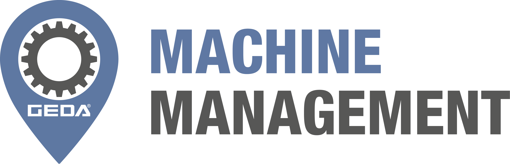

# GEDA Machine Management AEMP 2.0 / ISO 15431-3 API



## Deutsch

Das GEDA Machine Management ist Bestandteil von GEDA Central (https://central.geda.de).

Maschinen, welche mit GEDA IoT-Hardware ausgestattet sind, übermitteln Nutzungsdaten, Standorte und Diagnosemeldungen an GEDA Central, wenn sie mit einem GEDA Central-Account verknüpft und aktiviert sind.

Dieses Repository enthält die YAML-Dokumentation und einfachen Beispielcode für die integrierte AEMP-2.0-Schnittstelle (ISO 15431-3), die einen standardisierten Zugriff auf verfügbare Datenpunkte auch außerhalb von GEDA Central ermöglicht.

### Kompatible IoT-Hardware

Die AEMP-2.0-Schnittstelle ist mit allen verfügbaren GEDA IoT-Boxen kompatibel.

- GEDA IoT-Box Standard
- GEDA IoT-Box Premium

Weiterführende Informationen:
https://www.geda.de/produkte/central/machinemanagement/

### Inhalt

- OpenAPI/YAML-Spezifikation der Schnittstelle
- Python-Beispielcode für den Zugriff auf paginierte Endpunkte

### Kurzanleitung: Python-Beispiel ausführen

#### Linux / macOS

1. Virtuelle Umgebung erstellen:

```bash
python3 -m venv .venv
```

2. Virtuelle Umgebung aktivieren:

```bash
source .venv/bin/activate
```

3. Abhängigkeiten installieren:

```bash
pip install -r requirements.txt
```

4. API-Token setzen (empfohlen als Umgebungsvariable):

```bash
export AEMP_API_TOKEN="<Ihr-API-Token>"
```

5. Skript starten:

```bash
python src/aemp_paginated.py
```

Optional mit Parametern:

```bash
python src/aemp_paginated.py --output snapshot.json
```

**Alternative:** Token direkt als Parameter übergeben (ohne Umgebungsvariable):

```bash
python src/aemp_paginated.py --token "<Ihr-API-Token>" --output snapshot.json
```

#### Windows

1. Virtuelle Umgebung erstellen:

```cmd
python -m venv .venv
```

2. Virtuelle Umgebung aktivieren:

```cmd
.venv\Scripts\activate.bat
```

(Oder mit PowerShell: `.venv\Scripts\Activate.ps1`)

3. Abhängigkeiten installieren:

```cmd
pip install -r requirements.txt
```

4. API-Token setzen (empfohlen als Umgebungsvariable):

```cmd
set AEMP_API_TOKEN=<Ihr-API-Token>
```

(Oder mit PowerShell: `$env:AEMP_API_TOKEN="<Ihr-API-Token>"`)

5. Skript starten:

```cmd
python src/aemp_paginated.py
```

Optional mit Parametern:

```cmd
python src/aemp_paginated.py --output snapshot.json
```

**Alternative:** Token direkt als Parameter übergeben (ohne Umgebungsvariable):

```cmd
python src/aemp_paginated.py --token "<Ihr-API-Token>" --output snapshot.json
```

**Falls Python nicht im PATH ist:** Python mit vollem Pfad aufrufen:

Cmd:
```cmd
C:\path\to\python.exe src\aemp_paginated.py --token "<Ihr-API-Token>" --output snapshot.json
```

PowerShell:
```powershell
& "C:\path\to\python.exe" src\aemp_paginated.py --token "<Ihr-API-Token>" --output snapshot.json
```

(Typische Orte: `C:\Program Files\Python312\`, `C:\Python312\`, ...)

---

Das Skript lädt alle verfügbaren Seiten vom AEMP-Endpoint und schreibt die Ergebnisse als JSON-Datei.

### Zugangsdaten

Den API-Key können Sie in GEDA Central abrufen:
https://central.geda.de/machines?feedtoken

Voraussetzung ist, dass Sie in GEDA Central angemeldet und entsprechend berechtigt sind.

### Funktionsumfang

Mit dieser API können Maschinendaten systemübergreifend ausgetauscht und in eigene Anwendungen integriert werden, zum Beispiel für:

- Flotten- und Geräteübersicht
- Betriebsdatenanalyse und Reporting
- Integration in ERP-, Dispositions- oder Telematikprozesse

### Abgrenzung

Zur vollumfänglichen Integration der GEDA Maschinen in bestehende Management-Systeme für detaillierte Nutzungsauswertungen, zur systemübergreifenden Konfiguration des Zugangssystems sowie für die einfache Realisierung von Pay-per-Use-Szenarien steht in Verbindung mit der GEDA IoT-Box Premium optional eine zusätzliche, offene REST-API zur Verfügung.

Wenden Sie sich hierzu gerne an das GEDA-Team.

## English

GEDA Machine Management is part of GEDA Central (https://central.geda.de).

Machines equipped with GEDA IoT hardware send usage data, location data, and diagnostic events to GEDA Central, if they are linked to a GEDA Central account and have been activated.

This repository contains YAML documentation and sample code for the integrated AEMP 2.0 interface (ISO 15431-3), enabling standardized access to available data points from extermal applications.

### Compatible IoT Hardware

The AEMP 2.0 interface is compatible with all available GEDA IoT boxes.

- GEDA IoT-Box Standard
- GEDA IoT-Box Premium

Further information:
https://www.geda.de/produkte/central/machinemanagement/

### Contents

- OpenAPI/YAML specification of the interface
- Python sample code for paginated endpoint access

### Quick Start: Run the Python Sample

#### Linux / macOS

1. Create a virtual environment:

```bash
python3 -m venv .venv
```

2. Activate the virtual environment:

```bash
source .venv/bin/activate
```

3. Install dependencies:

```bash
pip install -r requirements.txt
```

4. Set your API token (recommended via environment variable):

```bash
export AEMP_API_TOKEN="<your-api-token>"
```

5. Run the script:

```bash
python src/aemp_paginated.py
```

Optional parameter:

```bash
python src/aemp_paginated.py --output snapshot.json
```

**Alternative:** Pass token directly as parameter (without environment variable):

```bash
python src/aemp_paginated.py --token "<your-api-token>" --output snapshot.json
```

#### Windows

1. Create a virtual environment:

```cmd
python -m venv .venv
```

2. Activate the virtual environment:

```cmd
.venv\Scripts\activate.bat
```

(Or with PowerShell: `.venv\Scripts\Activate.ps1`)

3. Install dependencies:

```cmd
pip install -r requirements.txt
```

4. Set your API token (recommended via environment variable):

```cmd
set AEMP_API_TOKEN=<your-api-token>
```

(Or with PowerShell: `$env:AEMP_API_TOKEN="<your-api-token>"`)

5. Run the script:

```cmd
python src/aemp_paginated.py
```

Optional parameter:

```cmd
python src/aemp_paginated.py --output snapshot.json
```

**Alternative:** Pass token directly as parameter (without environment variable):

```cmd
python src/aemp_paginated.py --token "<your-api-token>" --output snapshot.json
```

**If Python is not in PATH:** Call Python with the full path:

Cmd:
```cmd
C:\path\to\python.exe src\aemp_paginated.py --token "<your-api-token>" --output snapshot.json
```

PowerShell:
```powershell
& "C:\path\to\python.exe" src\aemp_paginated.py --token "<your-api-token>" --output snapshot.json
```

(Common locations: `C:\Program Files\Python312\`, `C:\Python312\`, ...)

---

The script fetches all available pages from the AEMP endpoint and writes the result to a JSON file.

### Access Credentials

You can retrieve your API key in GEDA Central.

Navigate to "Account Symbol" >> "Profile" (https://central.geda.de/user/profile) and scroll down to "Machine Management API Token".
Copy the "API Token for the free AEMP API".

**Do NOT share the API Token.**

You must be signed in to GEDA Central and have the required permissions.

### Scope

This API allows machine data to be exchanged across systems and integrated into your own applications, for example for:

- Fleet and equipment overview
- Operational analytics and reporting
- Integration into ERP, dispatching, or telematics processes

### Delimitation

For full integration of GEDA machines into existing management systems, including detailed utilization analysis, cross-system access configuration, and easy pay-per-use scenarios, an additional open REST API is optionally available in combination with the GEDA IoT-Box Premium.

Please contact the GEDA team for this option.
